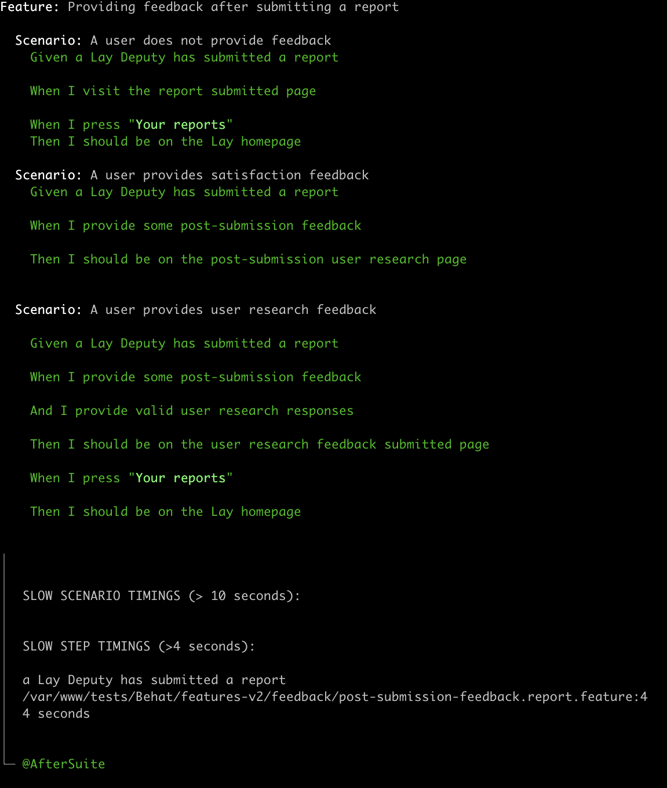

<!--
*** README template layout courtesy of https://github.com/othneildrew/Best-README-Template/blob/master/README.md 
-->

<!-- TABLE OF CONTENTS -->
<details open="open">
  <summary>Table of Contents</summary>
  <ol>
    <li>
      <a href="#about-the-project">About The Project</a>
      <ul>
        <li><a href="#built-with">Built With</a></li>
      </ul>
    </li>
    <li>
      <a href="#getting-started">Getting Started</a>
      <ul>
        <li><a href="#prerequisites">Prerequisites</a></li>
        <li><a href="#installation">Installation</a></li>
      </ul>
    </li>
    <li><a href="#usage">Usage</a></li>
    <li><a href="#contributing">Contributing</a></li>
    <li><a href="#license">License</a></li>
  </ol>
</details>


<!-- ABOUT THE PROJECT -->
## About The Project

A place to store commonly used Behat context files that provide useful statistics on test suites.

### Built With
* [Behat](https://behat.org)

<!-- GETTING STARTED -->
## Getting Started

The contexts included here are designed to be dropped in to a project without any setup required. 

### Prerequisites

* behat
  ```sh
  composer require --dev behat/behat
  ```

### Installation

Add to your project using composer:
```bash
composer require --dev ministryofjustice/behat-test-statistics
  ```

Alternatively, manually download the source code to persist in your project.

<!-- USAGE EXAMPLES -->
## Usage

There are two approaches to using the context file.

1. Add to your behat.yml suite config as a context:

```yaml
default:
    suites:
        ui-tests:
            description: A minimal UI test suite
            paths: [ "%paths.base%/features" ]
            filters:
                tags: "@ui"
            contexts:
                - App\Tests\Behat\FeatureContext
                - MinistryOfJustice\BehatContexts\TestStatisticsContext
```

2. Extend your base context file using `MinistryOfJustice\BehatContexts\TestStatisticsContext`:

```php
<?php

declare(strict_types=1);

namespace App\Tests\Behat\v2\Common;

class BaseFeatureContext extends MinistryOfJustice\BehatContexts\TestStatisticsContext
{}
```

Once the feature context is plugged into your test suites it will automatically flag any slow running suites or steps at the end of the test run:



<!-- CONTRIBUTING -->
## Contributing

Any contributions you make are **greatly appreciated**.

1. Fork the Project
2. Create your Feature Branch (`git checkout -b feature/AmazingFeature`)
3. Commit your Changes (`git commit -m 'Add some AmazingFeature'`)
4. Push to the Branch (`git push origin feature/AmazingFeature`)
5. Open a Pull Request


<!-- LICENSE -->
## License

Distributed under the MIT License. See [LICENSE](./LICENCE) for more information.
